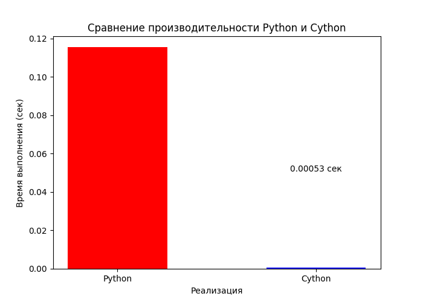
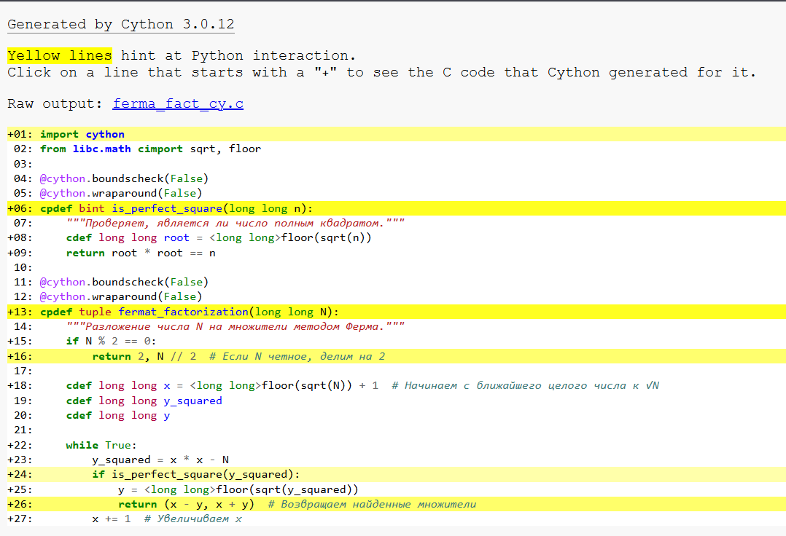
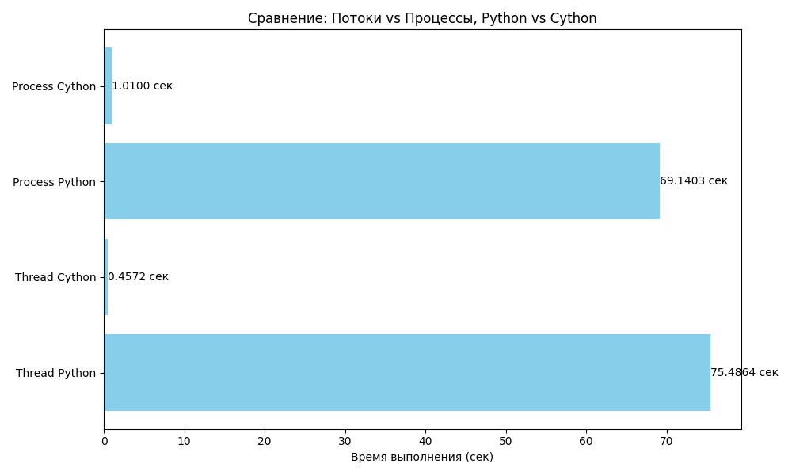
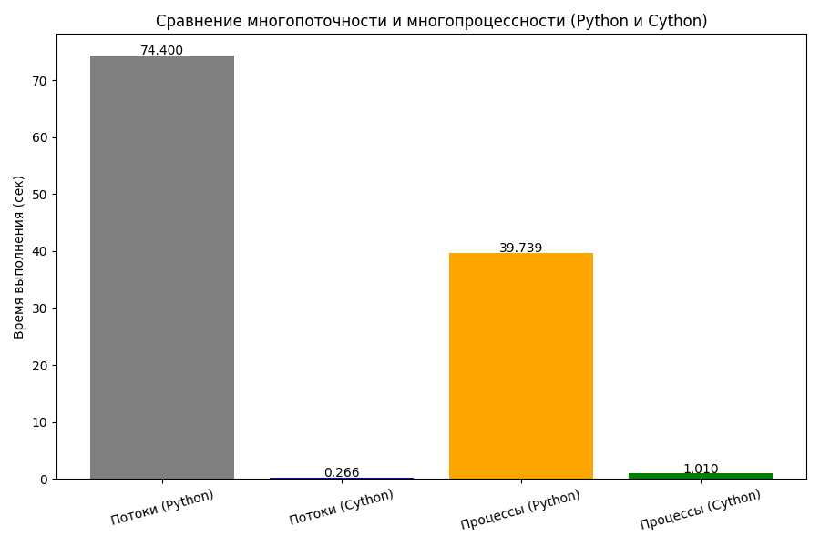

# Лабораторная работа №6
## Шаг 1

Шаг 1. Оставив представленный код, переписанв функция для нахождения чисел с помощью Cython, 
запущен timeit с аналогичными параметрами и сравнены два варианта, построин график:

С помощью annotate=True сгенерирован html (где визуализировано взаимодействие с Python-интерпретатором):

## Шаг 2

Создан механизм распределения вычислений так, чтобы массив данных для вычисления распределялся
на несколько "вычислителей" и каждый вычислитель считал свое /map-reduce

Результаты вычислений в виде графиков потоков и процессов двух реализаций функции по разложению числа на множители Cython-реализации и обычной:

## Шаг 3 Работа с GIL

Переписано многопоточное решение - map_reduce_nogil.py
При написании Cython-кода  использована конструкция with nogil, чтобы освободить GIL во время выполнения длительных операций. Это позволяет другим потокам продолжать выполнение.

Результаты выполнения:
Потоки (Python)           — 77.30553 сек
Потоки (Cython)           — 0.24269 сек
Процессы (Python)         — 27.29466 сек
Процессы (Cython)         — 1.31065 сек

